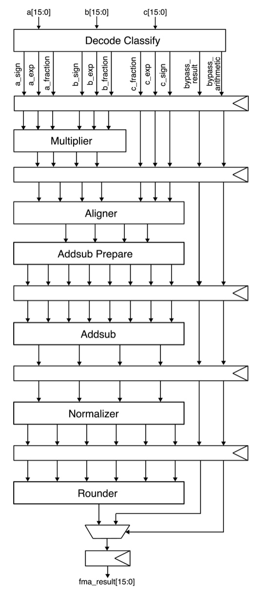
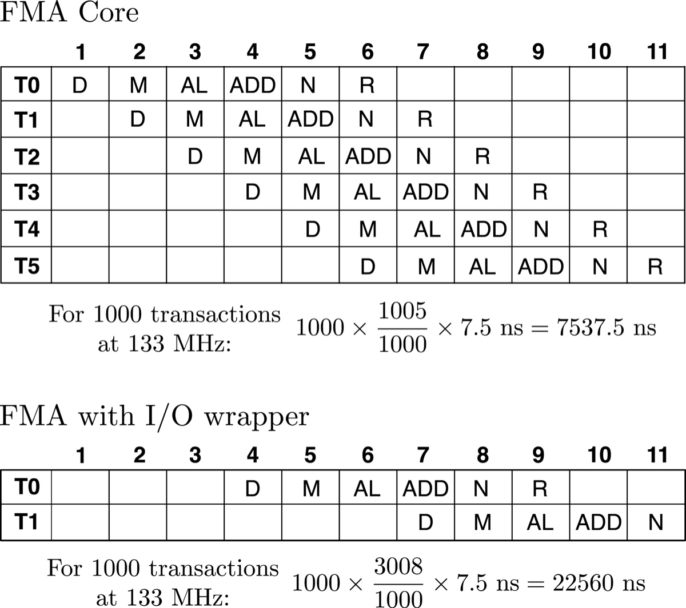
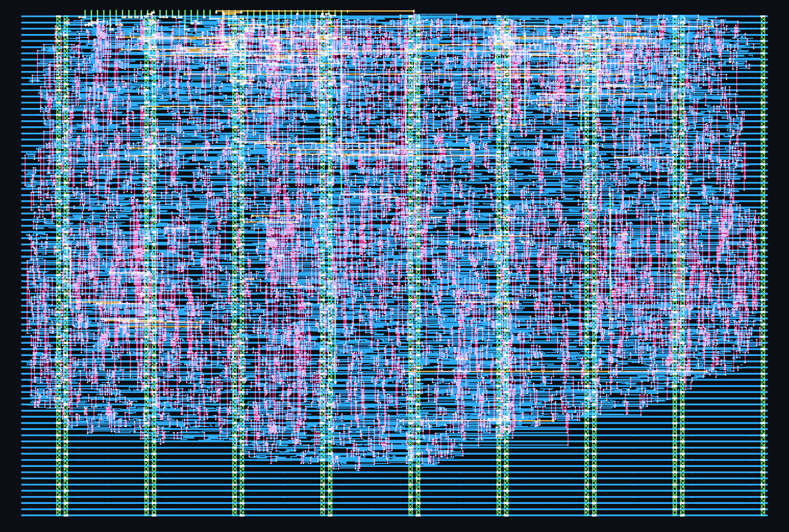
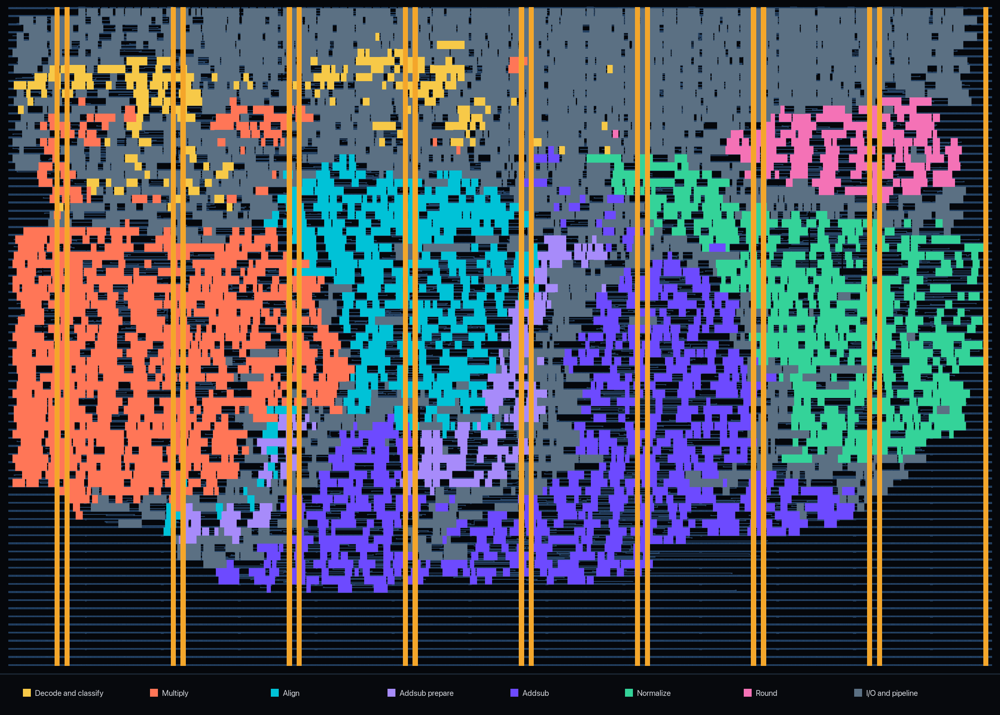
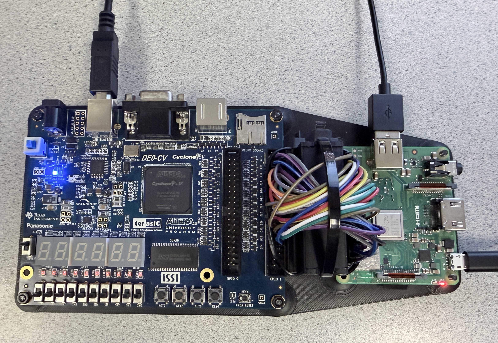
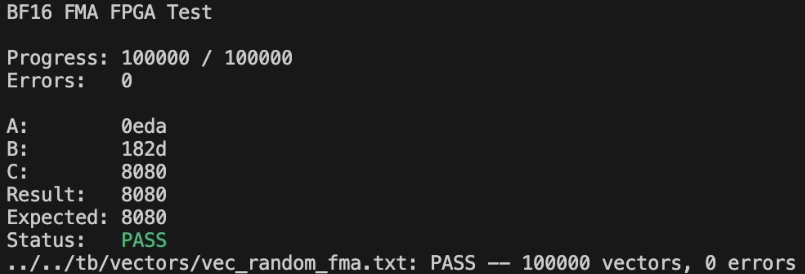

# Pipelined Bfloat16 Fused Multiply-Add

This project implements a pipelined Bfloat16 Fused Multiply-Add unit. It calculates `a * b + c` without rounding the intermediate product, and then rounds the final result to Bfloat16. The name "fused" comes from combining the multiplication and addition into one operation with one rounding step. This single rounding helps us preserve the product in full intermediate precision and improves the accuracy of the final result. My main motivation for the project was to get more experience with the floating point format and write RTL informed by tapeout flow area and critical path results. 

[](https://github.com/akankaan/bf16-fma/actions/workflows/test.yml)

## Project Highlights
- Computes `a * b + c` with only one final rounding step
- Three Bfloat16 operands and a Bfloat16 result
- Six-stage pipelined arithmetic core
- Round-to-nearest, ties-to-even (RNE) rounding
- Implemented in SystemVerilog
- Verified through simulation and formal verification
- Verified with 250M+ random vectors across 150 seeded simulation runs
- Passed all 100,000 random vectors during FPGA hardware testing
- Emulated on an FPGA and hardened in SKY130 and submitted through Tiny Tapeout

## Architecture

### Arithmetic Datapath



My implementation has six internal pipeline stages to reduce the critical path delay. This was especially useful for the FPGA emulation and the tapeout because their limited I/O requires three clock cycles to load each set of operands. Without pipelining, the clock period would be limited by the delay of the entire arithmetic datapath, meaning that each of these three load cycles would also use the longer clock period. These pipeline stages are:

1) Decode and classify: Extract the sign, exponent, and fraction from each operand while identifying zero, infinity, and NaN special values
2) Multiply: Multiply the significands and calculate product's exponent and sign
3) Align and prepare for addition: Shift the addend based on the exponent difference between the addend and product
4) Add: Add or subtract the aligned magnitudes and determine sum's sign
5) Normalize: Find leading one, shift result to the top of the datapath and adjust its exponent
6) Round: Round the normalized result to Bfloat16 using round-to-nearest, ties-to-even (RNE), and output the final encoded value

<br clear="right">

The main arithmetic unit is the `fma_core`, and it can also be used as the top instantiated module without the I/O wrapper. Pipeline diagrams and the throughput calculations for both the standalone core and the I/O wrapped unit are below:

<br clear="right">

<p align="center">
  
</p>

As calculated above, the I/O-wrapped unit takes approximately three times (2.9930×) as long as the standalone core to complete 1000 transactions. This is expected since the wrapper accepts one transaction every three cycles in steady state, compared to one transaction per cycle for the standalone core.

## Numerical Behavior Decisions

- The unit takes in three Bfloat16 number inputs and also outputs in the Bfloat16 format
- Addend is directly added to intermediate product without rounding
- The addend input is Bfloat16 rather than FP32
- Chosen rounding mode is RNE
- Subnormal inputs are considered zero (DAZ) and subnormal results are returned as signed zero (FTZ)
- RNE is the only rounding mode, no exception flags are produced, and all NaNs are returned as a quiet NaN `0x7FC0`

## Interface and Timing

There are two valid interfaces: one in the arithmetic core and one in the I/O wrapper. 

The arithmetic core takes in `operands_valid` and outputs `fma_result_valid` six cycles later with the calculated result for the valid operand inputs with the pipelining. 

The top level with the I/O wrapper on the other hand has an `in_valid` input for each one of the three 16-bit input cycles. The `loader` raises `operands_valid` high when all three operands are presented and starts the transaction. Once the core finishes the computation, the result is registered and outputted over two 8-bit output cycles in which `result_valid` is high.

## Tapeout

### Timing-Driven RTL Development

After each boundary insertion and optimization, I extracted the top ten critical paths from each pipeline stage. I compared the critical path delays across stages and inserted pipeline boundaries to evenly separate the delays as much as possible. One optimization was in the aligner where the synthesis tools did not infer a tree shifter and writing this tree structure explicitly moved the critical path outside the aligner. After boundary insertions, addsub delay was unbalanced relative to the rest of the pipeline. As a result, I separated addsub to two distinct modules and moved the preparatory module to the aligner stage. This resulted in a fairly optimized and balanced pipeline structure.

### Physical Results

<p align="center">
  
</p>

<p align="center">
  <em>Final routed SKY130 layout in a 2x2 Tiny Tapeout tile</em>
</p>

The design was hardened for the SKY130 using LibreLane and OpenROAD in a 2x2 Tiny Tapeout tile. The submitted configuration uses a 7.5 ns clock period, corresponding to 133.33 MHz, with closed setup and hold timing across all nine analyzed corners.

| Metric | Result |
| --- | ---: |
| Tiny Tapeout space | 2x2 tile |
| Clock Frequency | 133.33 MHz (7.5 ns) |
| Core area | 72,564.6 µm² |
| Standard-cell area | 42,335.6 µm² |
| Standard-cell utilization | 58.34% |
| Standard and sequential cells | 5,606 and 399 |
| Nominal-corner setup slack | +3.182 ns |
| Worst-corner setup slack | +0.647 ns |
| Worst hold slack | +0.104 ns |
| Estimated nominal power | 12.58 mW |
| DRC, LVS, and antenna violations | 0 |

The worst setup corner was the slow process corner at 100 °C and 1.60 V. The tapeout physical design configuration and layout are available in the [`tt_um_bf16_fma`](https://github.com/akankaan/tt_um_bf16_fma) repository.

### Post-Route Stage Timing

The following table shows the critical timing path through each pipeline stage at the slow setup corner:

| Stage | Total delay | Setup slack |
| --- | ---: | ---: |
| Decode and classify | 3.43 ns | +4.07 ns |
| Multiply | 6.85 ns | +0.65 ns |
| Align and prepare addition | 6.75 ns | +0.75 ns |
| Add/subtract | 6.06 ns | +1.44 ns |
| Normalize | 6.46 ns | +1.04 ns |
| Round and select result | 5.09 ns | +2.41 ns |

The multiplier is the critical stage with the alignment and normalization fairly balanced and not far behind.

The annotated layout below shows the area breakdown of the main RTL modules. The loader, outputter, and pipeline registers are grouped under I/O and pipeline.



<p align="center">
  <em>Layout colored by module</em>
</p>

## Verification

### Simulation
- Used exact Python reference model using `Fraction`
- Directed, random, exhaustive-shift, and special-value vectors
- Unit testing for each RTL module along end-to-end `fma` and `fma_core` testbenches
- Further extended random testing with overnight seed sweep testing with 150 different seeds, covering 250M+ random vectors in total

### Formal verification
I wanted to also learn more about formal verification and used SymbiYosys for this purpose. I did formal for the loader, outputter, and combined FMA I/O. Although these modules accept many possible operand and result values, their control behavior depends only on a small internal counter. Keeping the data symbolic allows every value to be checked without exhaustively checking each individually.

I also verified that the aligner's hierarchical shifter produces the same outputs as a simpler behavioral reference.

### Hardware Testing on FPGA

I also tested the design on a Terasic DE0-CV with a Cyclone V FPGA. A Raspberry Pi 3 Model A+ is connected directly to the FPGA through GPIO. The Pi drives the input as well as the clock and reset, while the FPGA returns `result_valid` and the result over the 8-bit output.

The C test program on the Pi reads the same FMA vector files used by the RTL simulations. For each vector, it sends `a`, `b`, and `c` over three clock cycles, forms the 16-bit result from the two output bytes, and compares it against the expected value.



<p align="center">
  <em>DE0-CV and Raspberry Pi setup used to run FMA test vectors over GPIO</em>
</p>

The Quartus project and pin assignments are in [`fpga/quartus`](fpga/quartus), while the Raspberry Pi test program is in [`fpga/pi`](fpga/pi).  The FPGA resource usage was less than 2%. 

Both the directed tests and all 100,000 random vectors passed on the FPGA with no errors:

<p align="center">
  
</p>

## Running the Simulations

### Requirements
- Python 3
- Icarus Verilog
- Verilator
- SymbiYosys/OSS CAD Suite for formal verification

### Run the tests

```sh
make vectors
make test
make formal
```
